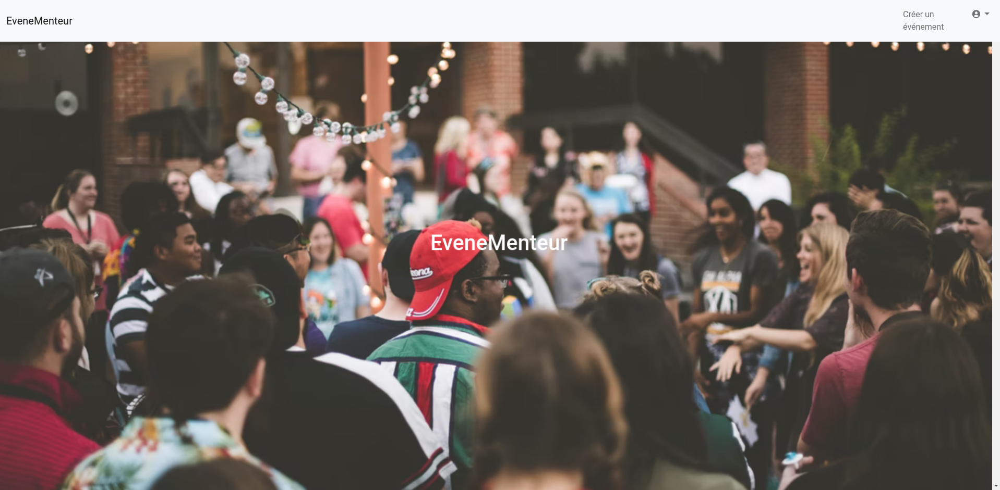
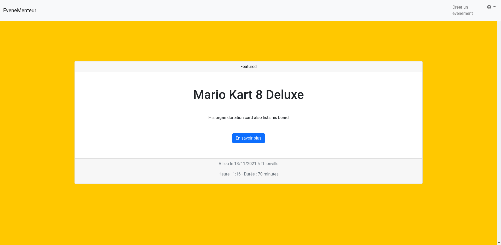

# EveneMenteur

[](https://forthebadge.com)
[](https://forthebadge.com)
[](https://forthebadge.com)
[](https://forthebadge.com)

[](https://rubyonrails.org/)

## Aperçu

Votre nouveau site préféré pour assister et créer des événements en tout genre. 🎶

Site web codé sur Ruby on Rails pendant la semaine 7 de THP.

## Screenshots & Live Site

[Accéder au site web](https://evenementeur.herokuapp.com/)

[](https://evenementeur.herokuapp.com/)

[](https://evenementeur.herokuapp.com/)

## Versions

[](https://www.ruby-lang.org/fr/) V 2.7.4

[](https://rubyonrails.org/) V 5.2.3

## Installation et lancement

1. Ouvrez un terminal
2. Rendez-vous dans le répertoire du projet
3. Entrez :

```shell
$ bundle install
$ rails db:create
$ rails db:migrate
$ rails db:seed
$ rails server
```
4. Ouvrez votre navigateur à l'URL fournie par le serveur *(habituellement `http://localhost:3000/`)*
5. C'est parti pour le fun ! Bonne correction !

## ToDo

- [x] Database
- [x] Mailer
- [x] Authentification (via Devise)

Views :

- [x] Events Index
- [x] User show
- [x] User new
- [x] User edit
- [x] Event new
- [x] Event show

## Crédits et remerciements

Merci à [The Hacking Project](https://www.thehackingproject.org/) et à tous les moussaillons pour cette formation de qualité !
